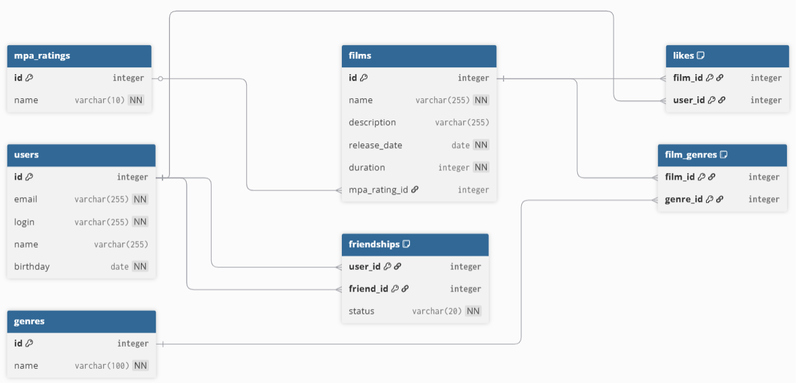

# java-filmorate

## 🗄️ Схема базы данных



### 📚 Описание таблиц

#### `users` — Пользователи
| Поле | Тип | Описание |
|------|-----|----------|
| `id` | INT (PK) | Уникальный идентификатор |
| `email` | VARCHAR | Email (уникальный, не пустой, содержит @) |
| `login` | VARCHAR | Логин (уникальный, без пробелов) |
| `name` | VARCHAR | Имя для отображения (если пусто — используется login) |
| `birthday` | DATE | Дата рождения (не в будущем) |

#### `films` — Фильмы
| Поле | Тип | Описание |
|------|-----|----------|
| `id` | INT (PK) | Уникальный идентификатор |
| `name` | VARCHAR | Название (не пустое) |
| `description` | VARCHAR | Описание (макс. 200 символов) |
| `release_date` | DATE | Дата релиза (≥ 28.12.1895) |
| `duration` | INT | Продолжительность в минутах (> 0) |
| `mpa_rating` | VARCHAR | Рейтинг MPA: `G`, `PG`, `PG-13`, `R`, `NC-17` |

#### `genres` — Жанры (справочник)
| Поле | Тип | Описание |
|------|-----|----------|
| `id` | INT (PK) | Уникальный идентификатор |
| `name` | VARCHAR | Название жанра (уникальное) |

#### `film_genres` — Связь фильмов и жанров
| Поле | Тип | Описание |
|------|-----|----------|
| `film_id` | INT (FK) | Ссылка на `films.id` |
| `genre_id` | INT (FK) | Ссылка на `genres.id` |
| **PK** | `(film_id, genre_id)` | Один жанр у фильма |

#### `friendships` — Дружба между пользователями
| Поле | Тип | Описание |
|------|-----|----------|
| `user_id` | INT (FK) | Пользователь, отправивший запрос |
| `friend_id` | INT (FK) | Пользователь, получивший запрос |
| `status` | VARCHAR | `'unconfirmed'` — ожидает подтверждения, `'confirmed'` — дружба подтверждена |
| **PK** | `(user_id, friend_id)` | Один запрос на пару пользователей |

#### `likes` — Лайки к фильмам
| Поле | Тип | Описание |
|------|-----|----------|
| `film_id` | INT (FK) | Ссылка на фильм |
| `user_id` | INT (FK) | Ссылка на пользователя |
| **PK** | `(film_id, user_id)` | Один лайк от пользователя на фильм |

---

### 🔍 Примеры SQL-запросов для основных операций

#### 👤 Пользователи
```sql
-- Получить всех пользователей
SELECT * FROM users;

-- Получить пользователя по ID
SELECT * FROM users WHERE id = 5;

-- Создать нового пользователя
INSERT INTO users (email, login, name, birthday) 
VALUES ('user@example.com', 'userlogin', 'Имя', '1990-01-01');

-- Получить все фильмы
SELECT * FROM films;

-- Получить фильм с жанрами
SELECT f.*, GROUP_CONCAT(g.name) as genres
FROM films f
LEFT JOIN film_genres fg ON f.id = fg.film_id
LEFT JOIN genres g ON fg.genre_id = g.id
WHERE f.id = 1
GROUP BY f.id;

-- Добавить фильм с жанрами
INSERT INTO films (name, description, release_date, duration, mpa_rating) 
VALUES ('Название', 'Описание', '2024-01-01', 120, 'PG-13');
-- Затем для каждого жанра:
INSERT INTO film_genres (film_id, genre_id) VALUES (LAST_INSERT_ID(), 3);

-- Поставить лайк фильму
INSERT INTO likes (film_id, user_id) VALUES (1, 5);

-- Удалить лайк
DELETE FROM likes WHERE film_id = 1 AND user_id = 5;

-- Топ-N популярных фильмов по лайкам
SELECT f.*, COUNT(l.user_id) as likes_count
FROM films f
LEFT JOIN likes l ON f.id = l.film_id
GROUP BY f.id
ORDER BY likes_count DESC, f.id
LIMIT 10;

-- Отправить запрос в друзья (статус: неподтверждённый)
INSERT INTO friendships (user_id, friend_id, status) 
VALUES (1, 2, 'unconfirmed');

-- Подтвердить дружбу
UPDATE friendships SET status = 'confirmed' WHERE user_id = 1 AND friend_id = 2;
INSERT INTO friendships (user_id, friend_id, status) 
VALUES (2, 1, 'confirmed');

-- Получить список друзей пользователя
SELECT u.*
FROM users u
JOIN friendships f ON u.id = f.friend_id
WHERE f.user_id = 1 AND f.status = 'confirmed'
UNION
SELECT u.*
FROM users u
JOIN friendships f ON u.id = f.user_id
WHERE f.friend_id = 1 AND f.status = 'confirmed';

-- Получить общих друзей двух пользователей
WITH friends_1 AS (
  SELECT friend_id as uid FROM friendships WHERE user_id = 1 AND status = 'confirmed'
  UNION
  SELECT user_id as uid FROM friendships WHERE friend_id = 1 AND status = 'confirmed'
),
friends_2 AS (
  SELECT friend_id as uid FROM friendships WHERE user_id = 2 AND status = 'confirmed'
  UNION
  SELECT user_id as uid FROM friendships WHERE friend_id = 2 AND status = 'confirmed'
)
SELECT u.*
FROM users u
WHERE u.id IN (SELECT uid FROM friends_1)
  AND u.id IN (SELECT uid FROM friends_2)
  AND u.id NOT IN (1, 2);


